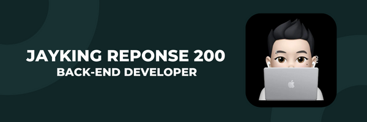

#### Github : [https://github.com/jaykingg](https://github.com/jaykingg)
#### Email  : js.wise10@kakao.com

## Introduce
***
안녕하세요!   
**"선한 영향력과 함께, 어제보다 더 나은 삶을 만드는 서비스를 만들자"**   
라는 모토를 가지고 백앤드개발을 하고있는 모준서입니다.   
커머스, 협업툴 등의 스타트업에서 서비스를 개발 및 운영해왔으며 주로    
Platform API 와 Testing, BackOffice 개발을 진행했습니다.   
기획을 파악하여 정확하게 서비스를 구현하고 양질의 코드로 기여하기 위해 커뮤니케이션을 가장 중요시 여기며 겸손이 제1 덕목이라 생각합니다.

Hello World!
"With good influence, let's create a service that makes life better than yesterday"
Its me who is doing back-end development with the motto.
I have developed and operated services at startups such as commerce and collaboration tools.    
And I developed Platform API, Testing, and BackOffice mainly.
In order to understand the plan, accurately implement the service, and contribute with quality code,    
Communication is considered the most important, and humility is the number one virtue.

## Skills
***
 * SpringBoot 2.0
 * Kotlin 1.6 / Java 17
 * Spring Webflux / Coroutine
 * MongoDB
 * Postgres
 * Kafka
 * AWS ECS
 * Docker
 * Nginx
 * Redis

## Career
***
### 하비풀 2022.06 -
#### Back-End 
* 서비스 런칭
  * Service 런칭을 위한 v2 Upgrade 
  * MSA 로 아키텍쳐를 변경하여 Monolithic 의 한계점 개선 
  * Kafka(MSK)를 사용하여 Service 간 Messaging 처리
    
* 주문시스템 개발
  * 자사몰 주문서비스 개발
  * PG사 결제모듈 및 웹훅서비스 연동
  
* 관리자시스템 개발
  * 주문서 관리 및 주문상태 관리 서비스 개발
  * MongoDB search Aggregation 을 활용하여 검색기능 개발
  
* Github CI/CD 적용
* 통합테스트 작성 및 환경세팅

***
### 플로우 2020.08 - 2022.06
#### Enterprise
* Enterprise Customizing
  * Cloud Service 에서 기업형 Service 로 Enterprise Custom Service 개발
  * Enterprise Infra 구축  
* Front/Back-end Modularization
  * One Source 내 불필요 Resource 를 제거하기위한 기업별 Modularization 및 Code 개선   
* 채팅서버 HA
  * 단일채팅 서버에서의 이슈발생에 대응하기 위한 Redis 를 이용한 채팅서버 HA  

***
### 신원 2018.06 - 2019.06
#### IT 회계파트 개발팀
* 사내/법인 ERP 회계파트 서비스개발 및 운영
  * 현장/매장에서 필요한 기능들을 회계데이터 기반으로 서비스 개발  
* VCS 도입
  * 공유드라이브에 코드를 저장하는 형태에서 VCS(Git)를 도입 추진 및 적용  

## ETC.
***
* 2018.01 해커톤 아이디어 투표율 1위
* 2018.08 정보처리기사 취득
* 2016.11 ICT 학술대회 논문게재
* 2015.11 공대 프로그래밍 대회 동상
* 2015.11 한이음 BIG 프로젝트 전시상